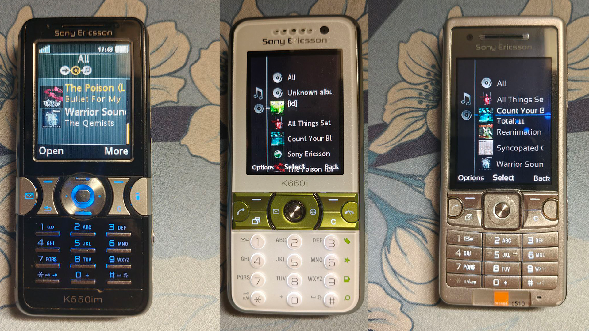

## Introduction 
I, [sdardouchi](https://github.com/sdardouchi), have battled a lot against the ID3v2 parsers present in Sony Ericsson Walkman player applications.
I have learned how ID3v2 headers work just so I could work around these pesky parsing issues, most notoriously, the one where the album cover doesn't show.

## Prerequisites
You will need FFMPEG and Python 3.

### For Debian-based distros:
```sh
sudo apt update
sudo apt install ffmpeg python3
```

### For Arch-based distros:
```sh
sudo pacman -S ffmpeg python
```

### For RedHat-based distros:
```sh
sudo dnf install ffmpeg python3
```

### For macOS:
```sh
brew install ffmpeg python
```

## Usage
I suggest you create a `venv` and use that to install the prerequisites
```bash
python -m venv venv
source venv/bin/activate # .\venv\Scripts\activate.ps1 if you're on Windows
pip install -r requirements.txt
python semp3fixer.py <source_folder> <destination_folder> # You can optionally specify the FFMPEG path in case it's not in $PATH 
```

## Preview
